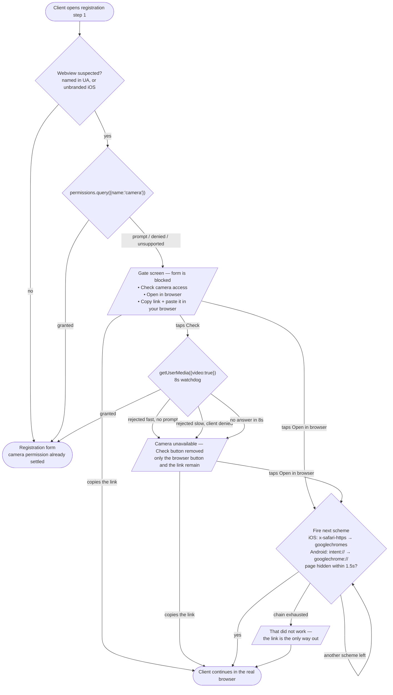

# DEV-48595 — step-1 gate flow

Prototype: [`flow.html`](https://sergejsd-sf.github.io/in-app-browser-test/flow.html)

## User journey

## Why the gate looks like this

`permissions.query` and `enumerateDevices` were measured across all ten app/platform
cells on 2026-08-18 and **neither can tell a blocked webview from a working one** —
every cell returns `prompt` and one `videoinput`, including the three where the camera
is genuinely dead. The block lives in the host app (Android `WebChromeClient`, iOS
`WKUIDelegate`), one layer below anything the web platform exposes. So the only usable
signal is an actual `getUserMedia` call, and the only way to make that call cheap is to
explain it first and let the client trigger it.

Asking on step 1 does not add a permission prompt: the document-upload widget is
mandatory, so the client has to grant the camera regardless. The gate moves that one
prompt earlier and uses the answer to route.

## Device matrix behind the branching

| App | iOS camera | iOS escape | Android camera | Android escape |
|---|---|---|---|---|
| Facebook | works | `x-safari-https` | works | `intent://` |
| Messenger | works | none measured | **hangs forever** | `intent://` |
| Instagram | works | `googlechromes` | works | `intent://` |
| TikTok | **blocked** | none measured | **blocked** | `intent://` |
| WeChat | works | none measured | works | **none measured** |

The escape button does not consult this table. Firing an unhandled URL scheme inside an
iOS webview was measured to do nothing at all — no error, no alert — so the button fires
every scheme its platform has, in order, 1.5s apart, and stops as soon as the page goes
hidden. That matters because **the user agent cannot tell Messenger from Facebook**: iOS
Messenger sends Facebook's own `FBAN/FBIOS` tokens, so any per-app rule would fire
Facebook's Safari scheme in Messenger regardless. (`IABMV/1` does separate the two on both
platforms, but it is undocumented and the chain makes it unnecessary.)

WhatsApp and Viber open links in the default browser and never reach a webview.

Camera works in 7 of 10 cells, which is why the gate must not fire on webview
detection alone. TikTok on iOS sends no app token at all, which is why the unbranded
iOS heuristic exists.

## What to check on a device

Open the prototype in each app and follow the screen. The log at the bottom has a copy
button. Worth confirming per app:

- the gate blocked or passed as the matrix predicts
- how `getUserMedia` ended: granted, rejected (and how fast), or no answer at all
- whether the escape button actually left the app, or the 1.5s watchdog caught it
- whether the live video appears once the camera is granted
